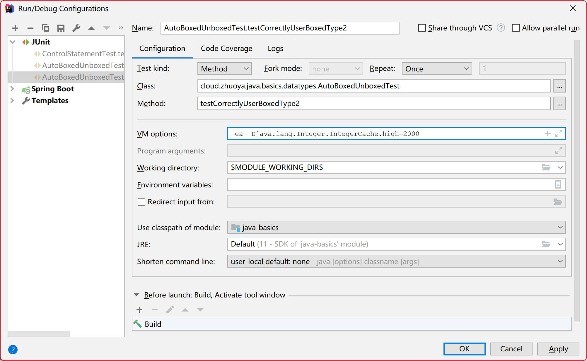

### 一、数据类型简介

数据在电脑中是以二进制形式存储的，那么要存储，就必须要指定数据的类型，因为每种数据类型，占用的存储空间不一样

所以在编程语言中，需要指定数据类型，以便于编译器如何存储数据


### 二、数据类型分类

#### 1）基本数据类型（8种）

- boolean

  作用：存放布尔数据

  使用场景：存储具有正反两面的事物数据

- byte

  作用：存放字节数据

  使用场景： IO 操作（字节流）

- char

  作用：存放字符数据

  使用场景：IO操作（字符流）

- short

  作用：存放短整型数据

  使用场景：用于一般的不是很大的数字

- int

  作用：存放整型数据

  使用场景：用于一般的数字

- long

  作用：存放整型数据

  使用场景：用在一些值较大的情况下

- float

  作用：存放单精度浮点数

  使用场景：用在精度不高的浮点运算中

- double

  作用：存放双精度浮点数

  使用场景：用在精度不高的浮点运算中

#### 2）引用数据类型

编程思想：**在Java中，所有引用类型，都是继承于 ` java.lang.Object` 类**

- 基本数据类型的包装类型

  - Boolean

  - Byte

  - Character

  - Short

  - Integer

  - Long

  - Float

  - Double

  - BigInteger

    用途：用于一些大整数的场景

  - BigDecimal

    用途：在金融、银行、证券等行业中用于货币的计算

- 其他引用类型

  其他继承自Object类的对象类型

  举例：定义一个Student类型

  ```java
  import lombok.Data;
  
  /**
   * 学生类
   * @author Aris Hu created at 2022-08-08
   */
  @Data
  public class Student implements Serializable {
  
    private static final long serialVersionUID = 7093938957600439336L;
  
    /** 学生证号 */
    private Long userId;
  
    /** 是不是来自中国 */
    private Boolean fromChina;
  
    /** 中文姓名 */
    private String name;
  
    /** 姓(外国人使用) */
    private String firstName;
  
    /** 名(外国人使用) */
    private String lastName;
  
    /** 性别 */
    private Short gender;
  
    /** 年龄 */
    private Short age;
  
    /** 加密后的身份证号 */
    private String encryptedIdentityCardNo;
  
    /** 加密后的手机号 */
    private String encryptedMobile;
  
    /** 加密后的邮箱号 */
    private String encryptedEmail;
  }
  ```

  

### 三、基本数据类型的取值范围

说明：Java中的数据都是有符号的

- boolean

  只有两个值：true 或 false

- byte

  **占用空间**：1个字节

  **取值范围（值域）**：128（$2^{-7}$，包含在内）~ 127 （$2^{7} - 1$，包含在内）或  [-128, 127]

- char

  说明：字符只有正数部分

  **占用空间**：2个字节

  **取值范围（值域）：**0（包含在内）~ 65535 （$2^{16} - 1$，包含在内）或  [0, 65525]

- short

  **占用空间**：2个字节

  **取值范围（值域）**：-32768（$-2^{15}$，包含在内）~ 32767 （$2^{15} - 1$，包含在内）或  [-32768, 32767]

- int

  **占用空间**：4个字节

  **取值范围（值域）**：-2147483648（$-2^{31}$，包含在内）~ （$2^{31} - 1$，包含在内）或  [-2147483648, 2147483647]

- long

  **占用空间**：8个字节

  **取值范围（值域）**：$-2^{63}$（包含在内）~ $2^{63} - 1$（包含在内）或  [-128, 127]

- float

  **占用空间**：4个字节，32位

- double

  **占用空间**：8个字节，64位


注意事项：

- byte、char、short在进行算术运算时，会自动提升为 int 类型

- float 和 double 遵循 ***IEEE754标准***

  float，最高位表示符号位，高23位表示整数部分，低8位表示小数部分

  double，最高位表示符号位，高52位表示整数部分，低11位标识小数部分


### 四、注意事项

#### 1）Integer对象的创建问题（性能优化方面）

为什么 JDK9 抛弃了 `new Integer(int i)` 这个构造器，然后推荐使用静态工厂方法 `Integer.valueOf(int i)` 来创建Integer对象？

原因：`Integer.valueOf(int)`方法**加了一个数值数据的缓存**，对于在缓存范围内的值，直接从缓存中读取，而不需要重新创建对象，从而提高了空间和时间上的性能。

```java
private static class IntegerCache {
    static final int low = -128;
    static final int high;
    static final Integer cache[];

    static {
        // high value may be configured by property
        int h = 127;
        // 读取虚拟机参数
        String integerCacheHighPropValue =
            VM.getSavedProperty("java.lang.Integer.IntegerCache.high");
        if (integerCacheHighPropValue != null) {
            try {
                // 将字符串转成整数
                int i = parseInt(integerCacheHighPropValue);
                i = Math.max(i, 127);
                // Maximum array size is Integer.MAX_VALUE
                // 获取上限值
                h = Math.min(i, Integer.MAX_VALUE - (-low) -1);
            } catch( NumberFormatException nfe) {
                // If the property cannot be parsed into an int, ignore it.
            }
        }
        high = h;
		// 创建数组对象
        cache = new Integer[(high - low) + 1];
        // 给缓存赋值, 将所需的Integer对象加入到缓存
        int j = low;
        for(int k = 0; k < cache.length; k++)
            cache[k] = new Integer(j++);

        // range [-128, 127] must be interned (JLS7 5.1.7)
        assert IntegerCache.high >= 127;
    }

    private IntegerCache() {}
}


@HotSpotIntrinsicCandidate
public static Integer valueOf(int i) {
  // 如果 i 的值在缓存范围内, 那么直接从缓存中读取
  if (i >= IntegerCache.low && i <= IntegerCache.high)
    return IntegerCache.cache[i + (-IntegerCache.low)];
  // 不在缓存中，就直接创建对象
  return new Integer(i);
}
```


#### 2）在基本类型与其包装类型都能使用时，优先使用基本类型

##### 两者有三个区别

- 基本类型只有值，而包装类型**具有对象的同一性**

  因为基本类型只要值相等，两个变量就相等

  而包装类型的两个变量，即使值相等，也可能是不同对象，对象的相等是 hashCode值相等 且 两个对象的内部值(或状态)相等（equals方法比较时相等）

- 基本类型只有一个数值，而包装类型**除了有基本数值外，还有一个 null 值**

- **基本类型比包装类型更节省时间和空间**

##### 实际使用时的陷阱

- **对包装类型使用了 双等号比较 （==）**，可能得不到想要的结果

  **错误的比较方式**

  ```java
  @Test
  @DisplayName("不合理地对包装类使用双等号进行比较")
  public void testInCorrectlyUseBoxedTypeWithDoubleEquals() {
    /** 比较器 */
    Comparator<Integer> comparator = (i, j) -> (i < j) ? -1 : ( i == j ? 0 : 1);
    final Integer value1 = new Integer(42);
    final Integer value2 = new Integer(42);
    logger.info("comparator.compare(values,value2)={}", comparator.compare(value1, value2));
  }
  
  // 结果
  18:16:12.071 [main] INFO cloud.zhuoya.java.basics.datatypes.AutoBoxedUnboxedTest - comparator.compare(values,value2)=1
  ```

  为什么得到的结果是1？

  原因分析：

  - 第一点，使用 `new Integer(value)` 创建的是对象，即使value值相同，但是在java堆中创建的是两个不同的对象，而使用双等号比较对象，只能比较两个对象的内存地址是否一样，显然不同对象它们存放的堆内存地址是不一样的
  
  **解决方法一（推荐）**
  
  ```java
  @Test
  @DisplayName("正确地对包装类型进行比较")
  public void testCorrectlyUserBoxedType() {
    /** 比较器 */
    Comparator<Integer> comparator = (boxedI, boxedJ) -> {
      // 自动拆箱
      int i = boxedI, j = boxedJ;
      return (i < j) ? -1 : ( i == j ? 0 : 1);
    };
      // 不建议使用new Integer()来创建对象
    final Integer value1 = new Integer(42);
    final Integer value2 = new Integer(42);
    logger.info("comparator.compare(values,value2)={}", comparator.compare(value1, value2));
  }
  ```
  
  **解决方法二**
  
  如果**数值在 1个字节范围内(-128~127之间)** 或 **配置了虚拟机参数`-Djava.lang.Integer.IntegerCache.high=n` **，那么可以使用下面的方法
  
  - 数值在 -128~127之间
  
    ```java
    @Test
    @DisplayName("正确地对包装类型进行比较")
    public void testCorrectlyUserBoxedType2() {
      Comparator<Integer> comparator = (i, j) -> {
        logger.info("i = {}, j = {}", j, j);
        return (i < j) ? -1 : ( i == j ? 0 : 1);
      };
      final Integer value1 = Integer.valueOf(20);
      final Integer value2 = Integer.valueOf(20);
      logger.info("comparator.compare(values,value2)={}", comparator.compare(value1, value2));
    }
    
    // 结果
    20:26:00.894 [main] INFO cloud.zhuoya.java.basics.datatypes.AutoBoxedUnboxedTest - i = 20, j = 20
    20:26:00.896 [main] INFO cloud.zhuoya.java.basics.datatypes.AutoBoxedUnboxedTest - comparator.compare(values,value2)=0
    ```
  
    
  
  - 数值不在 -128~127之间，且没有指定虚拟机参数
  
    ```java
    @Test
    @DisplayName("正确地对包装类型进行比较")
    public void testCorrectlyUserBoxedType2() {
      Comparator<Integer> comparator = (i, j) -> {
        logger.info("i = {}, j = {}", j, j);
        return (i < j) ? -1 : ( i == j ? 0 : 1);
      };
      final Integer value1 = Integer.valueOf(2000);
      final Integer value2 = Integer.valueOf(2000);
      logger.info("comparator.compare(values,value2)={}", comparator.compare(value1, value2));
    }
    
    // 结果
    20:27:57.815 [main] INFO cloud.zhuoya.java.basics.datatypes.AutoBoxedUnboxedTest - i = 2000, j = 2000
    20:27:57.817 [main] INFO cloud.zhuoya.java.basics.datatypes.AutoBoxedUnboxedTest - comparator.compare(values,value2)=1
    ```
  
  - 数值不在 -128~127之间，且配置了虚拟机参数`-Djava.lang.Integer.IntegerCache.high=n`
  
    比如：配置了虚拟机参数`-Djava.lang.Integer.IntegerCache.high=2000`  
  
    
  
    ​			
  
    ```java
    @Test
    @DisplayName("正确地对包装类型进行比较")
    public void testCorrectlyUserBoxedType2() {
      Comparator<Integer> comparator = (i, j) -> {
        logger.info("i = {}, j = {}", j, j);
        return (i < j) ? -1 : ( i == j ? 0 : 1);
      };
      final Integer value1 = Integer.valueOf(2000);
      final Integer value2 = Integer.valueOf(2000);
      logger.info("comparator.compare(values,value2)={}", comparator.compare(value1, value2));
    }
    
    // 结果
    20:37:02.992 [main] INFO cloud.zhuoya.java.basics.datatypes.AutoBoxedUnboxedTest - i = 2000, j = 2000
    20:37:02.994 [main] INFO cloud.zhuoya.java.basics.datatypes.AutoBoxedUnboxedTest - comparator.compare(values,value2)=0
    ```


- 当基本类型与包装类型进行混合使用时，**没有为包装类型变量进行初始化，包装类型进行自动拆箱，可能会抛出空指针异常 `NullPointerException`**

  因为：没有为包装类型变量设置初始值，且由于是静态变量，虚拟机为给它赋初始值 `null`，当执行 `if`语句时，与基本类型进行比较，会自动进行拆箱操作，由于 变量`i`没有指向任何对象，所以不能进行自动拆箱，所以抛出空指针异常

  ```java
  public class IntegerAutoUnboxed {
      static Integer i;
      
      public static void main(String[] args) {
          if (i == 42) {
              System.out.println("Unavailable.");
          }
      }
  }
  
  // 结果
  java.lang.NullPointerException
  ```

  

- 不合理地混用 基本类型 与 包装类型，**可能会导致频繁地装箱与拆箱，从而导致性能下降**

  由于将 `sum`变量定义成了包装类型，在进行 复合赋值运算`sum += i`时，需要自动拆箱与 `i` 进行运算，运算后再赋值给 `sum` 变量，又需要自动装箱。

  当循环次数很大时，就会导致性能下降

  ```java
  public static void main(String[] args) {
      Long sum = 0L;
      for (long i = 0; i < Integer.MAX_VALUE; i++) {
          sum += i;
      }
      System.out.println(sum);
  }
  ```


> 参考链接
>
> | 术语         | 参考链接                                                     | 参考书名 |
> | ------------ | ------------------------------------------------------------ | -------- |
> | IEEE754标准  | https://baike.baidu.com/item/IEEE%20754/3869922              |          |
> | 单精度浮点数 | https://baike.baidu.com/item/%E5%8D%95%E7%B2%BE%E5%BA%A6%E6%B5%AE%E7%82%B9%E6%95%B0 |          |
> | 双精度浮点数 | https://baike.baidu.com/item/%E5%8F%8C%E7%B2%BE%E5%BA%A6%E6%B5%AE%E7%82%B9%E6%95%B0 |          |