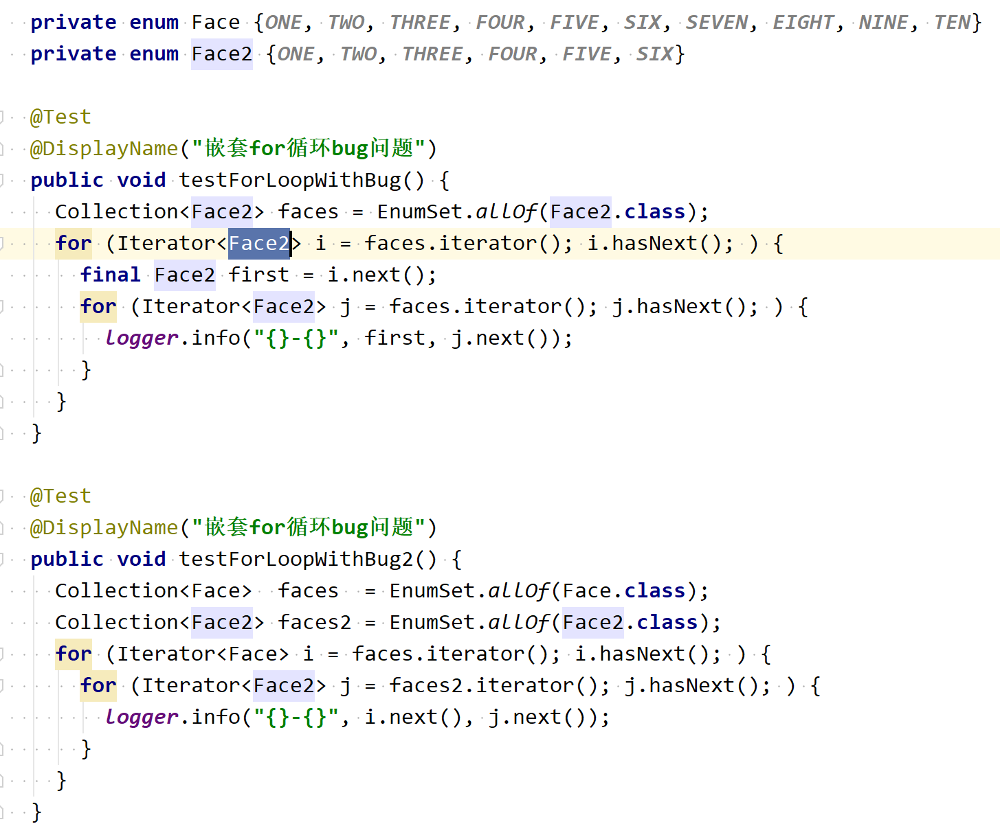

### 一、介绍

就像有知觉的生物一样，程序必须在执行过程中控制它的世界，并做出选择。在Java中，需要通过执行控制语句做出选择


### 二、三种类型

#### 1）分支语句（选择语句）

##### if语句

- 单 `if` 语句

  语法：

  ```java
  if (condition is true) {
     // statement
  }
  ```

  不推荐：

  ```java
  if (condition is true)
     // statement
  ```

- 单 `if-else` 语句

  语法：

  ```java
  if (condition is true) {
      // statement
  } else {
      // statement
  }
  ```

- 多 `if-else` 语句

  语法：

  ```java
  if (condition is true) {
      // statement
  } else if (condition is true) {
      //statement
  } else if (condition is true) {
      // statement
  } else {
      // statement
  }
  ```

  

#### switch语句

语法：

```java
// 通用形式
switch (interal-selector) {
    case interal-value: statement; break;
    case interal-value: statement; break;
    case interal-value: statement; break;
    // ...
    default: statement; [break;]
}

// 变体形式
switch (interal-selector) {
    case interal-value: 
    case interal-value: 
    case interal-value: {
        statement;
        break;
    }
    case interal-value:
    case interal-value: {
        statement;
        break;
    }
    // ...
    default: statement;
}
```


说明：

- 选择器的类型

  **注意事项：三种类型，其实都是针对一个整数进行比较的**

  - 整数及其包装类型：byte、char、short、int
    Byte、Character、Short、Integer

  - String类型

    本质：先比较字符串的hashCode，进入到指定的case语句后，再使用 equals() 方法比较两个字符串的值是否相等

    选择器是String类型，其实是一个语法糖

    原始代码：

    ```java
      @Test
      @DisplayName("Switch中选择器是字符串")
      public void testSwitchCaseWithString() {
    //    String name = "XiaoMing";
    //    String name = "XiaoHong";
        String name = "XiaoQing";
        String result = "与";
        switch (name) {
          case "XiaoMing": {
            result += (name + "处同性朋友");
            break;
          }
          case "XiaoHong": {
            result += (name + "搞对象");
            break;
          }
          default: {
            result += (name + "拜把子");
          }
        }
        logger.info("result: {}", result);
      }
    ```

    反编译后的代码：

    ```java
    @Test
    @DisplayName("Switch中选择器是字符串")
    public void testSwitchCaseWithString() {
      String name = "XiaoQing";
      String result = "与";
      byte var4 = -1;
      switch(name.hashCode()) {
      case 328886431:
        if (name.equals("XiaoHong")) {
          var4 = 1;
        }
        break;
      case 329029620:
        if (name.equals("XiaoMing")) {
          var4 = 0;
        }
      }
    
      switch(var4) {
      case 0:
        result = result + name + "处同性朋友";
        break;
      case 1:
        result = result + name + "搞对象";
        break;
      default:
        result = result + name + "拜把子";
      }
    
      logger.info("result: {}", result);
    }
    ```

  - enum类型（JDK5版本新增加的特性）

    本质：判断枚举值的 ordinal 属性是否相等（ordinal也是一个 int 类型）

- switch分支中不要忘记使用 break 或 return 操作

**常规用法一**：

```java
switch (interal-selector) {
    case interal-value: {
        statement; 
        break;
    }
    case interal-value: {
        statement; 
        break;
    }
   case interal-value: {
        statement; 
        break;
    }
    // ...
    default: statement;
}
```

**常规用法二：**

```java
switch (interal-selector) {
    case interal-value: {
        return statement; 
    }
    case interal-value: {
       return statement; 
    }
   case interal-value: {
        return statement; 
    }
    // ...
    default: return statement;
}
```


例子：

```java
  @Test
  @DisplayName("Switch中选择器是整数")
  public void testSwitchCaseWithInteger() {
//    int checkValue = 1;
//    int  checkValue = 2;
    int  checkValue = 4;
    int result = 0;
    switch (checkValue) {
      case 1: {
        result += checkValue;
        break;
      }
      case 2: {
        result -= checkValue;
        break;
      }
      default:
        ;
    }
    logger.info("result: {}", result);
  }

  @Test
  @DisplayName("Switch中选择器是字符")
  public void testSwitchCaseWithCharacter() {
    char checkValue = 'a';
//    char  checkValue = 'b';
//    char  checkValue = 'c';
    int result = 0;
    switch (checkValue) {
      case 'a': {
        result += checkValue;
        break;
      }
      case 'b': {
        result -= checkValue;
        break;
      }
      default:
        ;
    }
    logger.info("result: {}", result);
  }

  @Test
  @DisplayName("Switch中选择器是字符串")
  public void testSwitchCaseWithString() {
//    String name = "XiaoMing";
//    String name = "XiaoHong";
    String name = "XiaoQing";
    String result = "与";
    switch (name) {
      case "XiaoMing": {
        result += (name + "处同性朋友");
        break;
      }
      case "XiaoHong": {
        result += (name + "搞对象");
        break;
      }
      default: {
        result += (name + "拜把子");
      }
    }
    logger.info("result: {}", result);
  }

  @Test
  @DisplayName("Switch中选择器是枚举")
  public void testSwitchCaseWithEnum() {
    ClientType clientType = ClientType.WEB;
//    ClientType clientType = ClientType.ANDROID;
//    ClientType clientType = ClientType.IOS;
    String message = "Hello ";
    switch (clientType) {
      case WEB: {
        message += "Web Client";
        break;
      }
      case ANDROID: {
        message += "Android Client";
        break;
      }
      case IOS: {
        message += "IOS Client";
        break;
      }
      default: {
        message += "非法客户端";
      }
    }
    logger.info("message: {}", message);
  }

  @Test
  @DisplayName("Switch语句")
  public void testSwitchCaseWithSpecial() {
//    ClientType clientType = ClientType.WEB;
//    ClientType clientType = ClientType.ANDROID;
    ClientType clientType = ClientType.IOS;
    String message = "Hello ";
    switch (clientType) {
      case WEB: {
        message += "Web Client";
        break;
      }
      case ANDROID:
      case IOS: {
        message += "Mobile Client";
        break;
      }
      default: {
        message += "非法客户端";
      }
    }
    logger.info("message: {}", message);
  }
```


#### 2）循环语句

##### while语句

语法：

```java
while (condition is true) {
    // 循环体
}
```

循环条件：当条件满足才执行

##### do-while语句

语法：

```java
do {
    // 循环体
} while (condition is true);
```

循环条件：当条件满足才执行

说明：不论条件是否满足，总会执行一次

##### 传统的 for语句

语法：

```java
for (initialization；condition is true; step) {
    // for循环体
}

// 对于集合
Collection<String> col = ...;
for (Iterator<String> iter = col.iterator(); iter.hasNext(); ) {
    String element = iter.next();
    // ...
}
```

**<font color="red">for嵌套循环陷阱</font>**

错误原因：**在内存循环中，对外层循环的迭代器进行迭代**




##### for-each语法糖

说明：是传统for循环的一个衍生形式，是个语法糖

实际应用中，优先使用for-each循环：

- 简洁，代码逻辑清晰
- 灵活
- 不容易出错
- 没有性能损耗

不适用的场景：

- 如果需要遍历集合，对元素进行删除的场景

  因为这个过程需要调用集合的 remove 方法

- 如果需要遍历列表或数组，且要替换某个元素的值或所有元素的值的情况下
  因为此时需要迭代器或数组索引进行操作
- 如果需要并行地遍历多个集合的情况下
  因为此时需要显示控制迭代器 或者 索引变量


例子

```java
private enum Face {ONE, TWO, THREE, FOUR, FIVE, SIX, SEVEN, EIGHT, NINE, TEN}
private enum Face2 {ONE, TWO, THREE, FOUR, FIVE, SIX}

@Test
@DisplayName("嵌套for循环bug问题")
public void testForLoopWithBug() {
  Collection<Face2> faces = EnumSet.allOf(Face2.class);
  for (Iterator<Face2> i = faces.iterator(); i.hasNext(); ) {
    final Face2 first = i.next();
    for (Iterator<Face2> j = faces.iterator(); j.hasNext(); ) {
      logger.info("{}-{}", first, j.next());
    }
  }
}

@Test
@DisplayName("嵌套for循环bug问题")
public void testForLoopWithBug2() {
  Collection<Face>  faces  = EnumSet.allOf(Face.class);
  Collection<Face2> faces2 = EnumSet.allOf(Face2.class);
  for (Iterator<Face> i = faces.iterator(); i.hasNext(); ) {
    for (Iterator<Face2> j = faces2.iterator(); j.hasNext(); ) {
      logger.info("{}-{}", i.next(), j.next());
    }
  }
}
```


#### 3）跳转语句

##### return语句

作用

- 返回一个指定的值
- 退出当前方法体

##### break语句

作用：退出当前循环，不再执行break语句后的语句

##### continue语句

作用：放弃continue语句后的代码的执行，然后回到循环起始处重新执行下一次循环


##### 带标签的跳转

- `break <label>;`

  break跳出外层循环后，就不会再次进入循环了

- `continue <label>;`

  continue跳出外层循环后，会再次进入内存迭代进行下一次循环


例子：

```java
@Test
@DisplayName("带标签的跳转")
public void testBreakContinue() {
  int i = 0;
  outer:
  for (; true; ) {
    inner:
    for (; i < 10; i++) {
      logger.info("i: {}", i);
      if (i == 2) {
        logger.info("continue");
        continue;
      }

      if (i == 3) {
        logger.info("break");
        i++;
        break;
      }

      if (i == 7) {
        logger.info("continue outer");
        i++;
        continue outer;
      }

      if (i == 8) {
        logger.info("break outer");
        break outer;
      }

      for (int k = 0; k < 5; k++) {
        if (k == 3) {
          logger.info("continue inner");
          continue inner;
        }
      }
    }
  }
}

// 结果
16:28:50.576 [main] INFO cloud.zhuoya.java.basics.controlstatements.ControlStatementTest - i: 0
16:28:50.578 [main] INFO cloud.zhuoya.java.basics.controlstatements.ControlStatementTest - continue inner
16:28:50.578 [main] INFO cloud.zhuoya.java.basics.controlstatements.ControlStatementTest - i: 1
16:28:50.578 [main] INFO cloud.zhuoya.java.basics.controlstatements.ControlStatementTest - continue inner
16:28:50.578 [main] INFO cloud.zhuoya.java.basics.controlstatements.ControlStatementTest - i: 2
16:28:50.578 [main] INFO cloud.zhuoya.java.basics.controlstatements.ControlStatementTest - continue
16:28:50.578 [main] INFO cloud.zhuoya.java.basics.controlstatements.ControlStatementTest - i: 3
16:28:50.578 [main] INFO cloud.zhuoya.java.basics.controlstatements.ControlStatementTest - break
16:28:50.578 [main] INFO cloud.zhuoya.java.basics.controlstatements.ControlStatementTest - i: 4
16:28:50.578 [main] INFO cloud.zhuoya.java.basics.controlstatements.ControlStatementTest - continue inner
16:28:50.578 [main] INFO cloud.zhuoya.java.basics.controlstatements.ControlStatementTest - i: 5
16:28:50.578 [main] INFO cloud.zhuoya.java.basics.controlstatements.ControlStatementTest - continue inner
16:28:50.578 [main] INFO cloud.zhuoya.java.basics.controlstatements.ControlStatementTest - i: 6
16:28:50.578 [main] INFO cloud.zhuoya.java.basics.controlstatements.ControlStatementTest - continue inner
16:28:50.578 [main] INFO cloud.zhuoya.java.basics.controlstatements.ControlStatementTest - i: 7
16:28:50.578 [main] INFO cloud.zhuoya.java.basics.controlstatements.ControlStatementTest - continue outer
16:28:50.578 [main] INFO cloud.zhuoya.java.basics.controlstatements.ControlStatementTest - i: 8
16:28:50.578 [main] INFO cloud.zhuoya.java.basics.controlstatements.ControlStatementTest - break outer
```