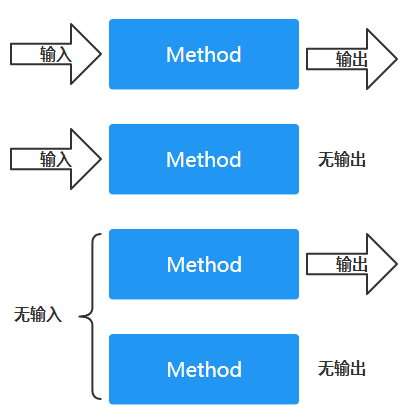

### 一、类概念与定义

#### 概念

类是面向对象编程的最小单元

#### 定义

```java
 [ public ] [ static | final | abstract ] class ClassName {
  	field1
  	field2
  	. . .
  	constructor1
  	constructor2
  	. . .
  	method1
  	method2
  	. . .
}
```

说明：

- ClassName是类的名称，必须和该类所在的文件名保持一致

- 类名称的命名规范： `Uppercase Camel`格式的，也就是每个单词的首字母都是大写的

- **类要么是包访问级别的，要么是共有级别的（public 修饰的）**

  ```java
  class ExampleClass {
    // ...
  }
  ```

  ```java
  public class ExampleClass {
    // ...
  }
  ```

  

- 修饰符说明

  - `static `修饰一个类，表示这个类是静态类
  - `final`  修饰一个类，表示这个类设计意图是成为不可变类，且不可以被继承
  - `abstract `修饰一个类，表明这个类是个抽象类

比如：

```java
public class SingleFieldEmployee {

  /** 员工标识 */
  private final Integer eId;

  /**
   * 使用指定的员工ID, 构建一个员工实例
   *
   * @param eId 员工ID
   */
  public SingleFieldEmployee(Integer eId) {
    this.eId = eId;
  }

  /**
   * 获取员工编号
   *
   * @return 员工编号
   */
  public Integer getId() {
    return eId;
  }
}
```

### 二、类的组成

#### 1）字段 或 域 （field）

##### 作用

- 表示对象的内部状态
- 以常量形式给外部提供服务

##### 定义

`[访问控制符] [static | final| volatile | transient] FieldType fieldName;`

修饰符说明：

- `static` 修饰的变量，表明是静态变量，是属于类的变量
- `final`  修饰的变量，表明是常量，赋值后值就是不变的，被修饰的变量也不会参与序列化
- `volatile`修饰的变量，用于多线程环境中，表示变量是可以被多线程可见的，且可以阻止指令重排，但是不能保证原子性
- `transient` 修饰的变量，在类实现了 `java.io.Serializable` 接口的前提下，表明这个变量不参与序列化与反序列化的过程，也就是说”不用麻烦你保存或恢复数据，我自己会处理的“

##### 种类

- 静态 field（`static field`）
  - 概念：使用static修饰的变量
  - 作用域：类所拥有的
  - 可以被该类的所有对象实例使用
- 实例 field（`instance field`）
  - 概念：只包含类型与字段名的 field
  - 作用域：对象所拥有的
  - 只能在当前对象内使用

#### 2）构造器、构造方法（Constructors）

##### 作用

用来初始化对象的状态

##### 定义

```java
public class SingleFieldEmployee {
  /** 员工标识 */
  private Integer eId;
  
  /**
   * 默认构造器 
   */
  public SingleFieldEmployee() {}
  
  /**
   * 使用指定的员工ID, 构建一个员工实例
   *
   * @param eId 员工ID
   */
  public SingleFieldEmployee(Integer eId) {
    this.eId = eId;
  }
}
```

说明：

- **构造器的名称必须和类的名称相同**

- **构造器中不要执行业务逻辑**

  因为执行业务逻辑，会拖慢对象的初始化过程，从而程序的执行性能

- **没有定义，编译器自动生成；只要已定义，编译器就不插手**

  - 如果没有为类定义任何构造器，那么编译器在编译时会为这个类增加一个默认构造器

  - 如果为一个类只定义了有参数的构造器，却没有定义无参构造器，那么编译器不会再为这个类添加默认构造器


##### 类型

- **无参构造器**（no-args constructor 或 default constructor）

  ```java
  public SingleFieldEmployee() {}
  ```

- **有参构造器**（parameterized constructor）

  ```java
  public SingleFieldEmployee(String eId) {
    this.eId = eId;
  }
  ```

##### 构造器重载（Constructor overloading）

[重载](./04-重载.md)
[如何使用构造器重载](./05-如何使用构造器重载.md)

#### 3）方法（Methods）

##### 作用

- 管理和操作对象的内部状态
- 为外部提供服务



##### 定义结构

- 抽象方法定义：`[访问控制符] abstract [泛型参数] ReturnType methodName(param_list);`

- 本地方法定义：`native [访问控制符] [泛型参数] ReturnType methodName(param_list);`

- 具体方法定义：

  ```java
  [访问控制符] [ static | final | synchronized ] [<泛型参数>] ReturnType methodName(param_list) {
      // body
  }
  ```

说明：

- **方法名说明**

  命名规范是 `LowerCase Camel` 格式的，也就是第一个单词都是小写，其余单词第一个字母大写

- **形式参数列表说明**

  形参列表可有可无，有的话使用逗号分隔，比如：`int compute(int a, int b)`

- **返回值说明**

  没有返回值的话，请使用 `void`，有返回值的话返回的是指定的类型

- **泛型参数说明**

  用于泛型编程中，在返回值之前定义，用于记录形式参数类型

- **修饰符说明**

  - `static` 修饰的方法是静态方法
  - `final `修饰的方法不可被重写（overriding）
  - `syncronized` 修饰的方法，用于多线程环境中，表明该方法是同步方法

##### 3个重要概念

- 方法签名（Method Signature）

  **方法签名 =** <font color="red">**方法名 + 形参列表**</font>
  说明：

  - **方法签名由方法名与形参列表唯一确定**

  - **方法的返回值不能作为方法签名的判断标准**


- 方法重载（Method Overloading）

  [重载](./04-重载.md)
  [如何使用方法重载](./06-如何使用方法重载.md)

- 方法覆盖（Method Overriding）

  在继承特性中使用


> 参考资料
>
> | 名称或术语       | 参考链接                                                    | 参考书籍                                                     |
> | ---------------- | ----------------------------------------------------------- | :----------------------------------------------------------- |
> | `volatile` 变量  |                                                             | CoreJava_Volume I: Fundamentals,12th.Horstmann<br />Java编程思想.第4版__Bruce Eckel_<br />Java并发编程实战_Briann Goetz_Doug Lea |
> | `transient `变量 | https://blog.csdn.net/qq_44543508/article/details/103232007 | Java编程思想.第4版__Bruce Eckel_                             |
> | 类说明、变量说明 |                                                             | 阿里巴巴Java开发规范                                         |
> | 常量、变量       |                                                             | CoreJava_Volume I: Fundamentals,12th.Horstmann<br />Java编程思想.第4版__Bruce Eckel_<br /> |
> | 构造器重载       |                                                             | Effective Java.3rd.JosuaBlock                                |