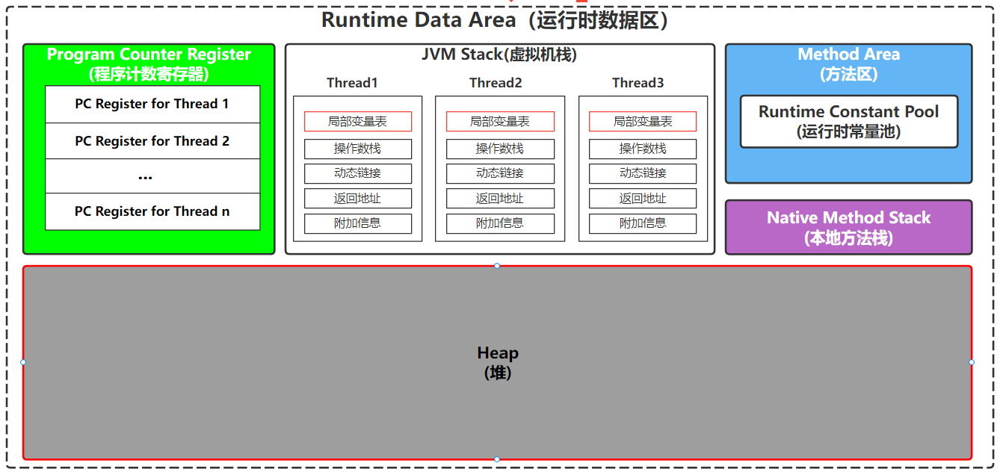
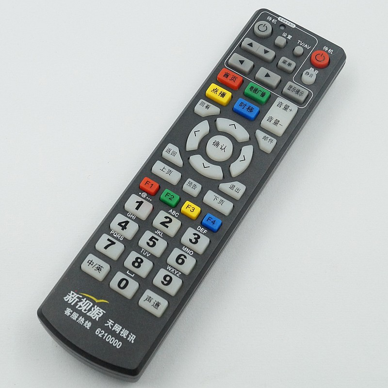

### 一、对象

#### 概念

一个类的实例，称为这个类的一个对象

#### 存储位置

对象是在虚拟机上的堆内存空间中分配的

#### 说明

- Java中的对象，**大部分需要程序员来自己创建**

  因为在后面 IOC 框架中（像 `Spring`），有的对象是容器帮我们创建的，并不需要我们手动去创建。

- **对象创建后，不需要程序员手动销毁对象，因为Java中有GC回收器和相关的回收算法**

  C++语言将对象的生命周期的控制权交给了程序员，所以C++程序员需要考虑对象在不用时需要释放对象所占用的内存资源；

  而Java中不一样，Java中所有程序都是运行Java虚拟机中的，可以暂时将虚拟机当作是一个操作系统，它提供了垃圾回收器（Gabage Collector）。

  当堆内存不足时，这个回收器会基于相关的垃圾回收算法，对堆内存中的某些对象进行回收

### 二、对象引用

#### 1）概念

对象内存地址的指针，类似于操纵电视机的遥控器（Remote Controller）

#### 2）存储位置

虚拟机栈（JVM Stack）中

#### 3）Java中的四种引用类型

- **强引用（Strongly Reference）**

  概念：就是 `Object obj = new Object()` 这种使用 `new` 关键字创建出的引用

  GC是如何对待这类引用的：只要引用存在，GC永远不会回收这类引用所指向的对象

- **软引用（Soft Reference）**

  概念：使用 `SoftReference` 类来接收对象的引用

  例子：`SoftReference<Date> softRef = new SoftReference<Date>(new Date());`

  作用：引用那些**有用但非必须**的对象的引用

  GC是如何对待这类引用的：当程序将要发生内存溢出前，会把这些对象标记为待回收的状态，然后第二次回收还没有足够内存，才会抛出 OOM(OutOfMemoryError) 错误

- **弱引用（Weak Reference）**

  概念：使用 `WeakReference`类来接收对象的引用

  例子：`WeakReference<Date> weakRef = new WeakReference<>(new Date());`

  作用：引用那些**非必须对象**

  GC是如何对待这类引用的：只能活到下一次GC操作为止

- **虚引用（Phantom Reference）**

  概念：使用 `PhantomReference` 类来定义

  作用：**最弱的一种引用，很少使用**

  例子：`PhantomReference ptRef = new PhantomReference(new Date(), null);`

#### 3）this关键字

代表当前对象，是对当前对象的一个引用

[this关键字的使用](./03-this关键字的使用.md)

