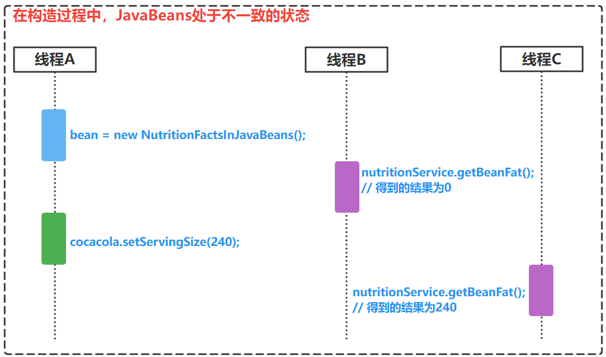

### 一、构造器重载常用形式

重叠型构造器（Telescoping Constructors）或 金字塔型构造器（Pyramid-shaped Constructors）


构造器重载

假如要定义一个牛奶类乳制品饮料的营养类

```java
import lombok.Data;

/**
 * 饮料营养成分类-金字塔类型构造器
 *
 * @author Aris Hu created at 2022-08-31
 */
@Data
public class TelescopingNutritionFacts {

  /** 抽样样本的毫升数,一般是100mL, 单位:mL */
  private final int servingSize;

  /** 每盒总含量, 单位: g */
  private final int servings;

  /** 每个样本包含的热量, 单位: kJ/serving */
  private final int calories;

  /** 每个样本包含的脂肪, 单位: g/serving */
  private final int fat;

  /** 每个样本包含的Na微量元素, 单位: mg/serving */
  private final int sodium;

  /** 每个样本包含的糖分, 单位: g/serving */
  private final int carbohydrate;

  /** 每个样本包含的维生素D含量, 单位: µg/serving */
  private final int vitaminD;

  public TelescopingNutritionFacts(int servingSize, int servings) {
    this(servingSize, servings, 0);
  }

  public TelescopingNutritionFacts(int servingSize, int servings, int calories) {
    this(servingSize, servings, calories, 0);
  }

  public TelescopingNutritionFacts(int servingSize, int servings, int calories, int fat) {
    this(servingSize, servings, calories, fat, 0);
  }

  public TelescopingNutritionFacts(int servingSize, int servings, int calories, int fat, int sodium) {
    this(servingSize, servings, calories, fat, sodium, 0);
  }

  public TelescopingNutritionFacts(
    int servingSize,
    int servings,
    int calories,
    int fat,
    int sodium,
    int carbohydrate) {
    this(servingSize, servings, calories, fat, sodium, carbohydrate, 0);
  }

  public TelescopingNutritionFacts(
    int servingSize,
    int servings,
    int calories,
    int fat,
    int sodium,
    int carbohydrate,
    int vitaminD) {
    this.servingSize = servingSize;
    this.servings = servings;
    this.calories = calories;
    this.fat = fat;
    this.sodium = sodium;
    this.carbohydrate = carbohydrate;
    this.vitaminD = vitaminD;
  }
}
```

#### 缺点

当类中有许多参数的时候，客户端代码会变得很难编写且很难阅读

- 开发者如果想要知道哪些值是什么意思，需要数着参数去找出参数是什么意思
- 如果调用者不小心颠倒了某两个参数的顺序，编译时可能不会出错，但运行的时候可能会出现错误	·	··  

### 二、解决方案

#### 解决方案一：使用 *JavaBeans* 模式

##### 1）概念

*JavaBeans* 模式得具备**三要素**：

- **必须有一个无参构造器 或 默认构造器**
- **所有属性必须私有化**
- **必须为所有私有化属性提供共有的(public 修饰的) getters 和 setters 方法**

##### 2）具体做法

**先调用一个无参构造器，然后调用 setter 方法来设置每个必要的参数和可选参数**

##### 3）代码

```java
import lombok.Data;

/**
 * JavaBeans模式下的液体牛奶类营养成分类
 *
 * @author Aris Hu created at 2022-08-31
 */
@Data
public class NutritionFactsInJavaBeans {

  /** 抽样样本的毫升数,一般是100mL, 单位:mL */
  private int servingSize;

  /** 每盒总含量, 单位: g */
  private int servings;

  /** 每个样本包含的热量, 单位: kJ/serving */
  private int calories;

  /** 每个样本包含的脂肪, 单位: g/serving */
  private int fat;

  /** 每个样本包含的Na微量元素, 单位: mg/serving */
  private int sodium;

  /** 每个样本包含的糖分, 单位: g/serving */
  private int carbohydrate;

  /** 每个样本包含的维生素D含量, 单位: µg/serving */
  private int vitaminD;

  /**
   * 构造器
   */
  public NutritionFactsInJavaBeans() {}

  public void setServingSize(int servingSize) {
    this.servingSize = servingSize;
  }

  public void setServings(int servings) {
    this.servings = servings;
  }

  public void setCalories(int calories) {
    this.calories = calories;
  }

  public void setFat(int fat) {
    this.fat = fat;
  }

  public void setSodium(int sodium) {
    this.sodium = sodium;
  }

  public void setCarbohydrate(int carbohydrate) {
    this.carbohydrate = carbohydrate;
  }

  public void setVitaminD(int vitaminD) {
    this.vitaminD = vitaminD;
  }
}
```

```java
NutritionFactsInJavaBeans cocacola = new NutritionFactsInJavaBeans();
cocacola.setServingSize(240);
cocacola.setServings(8);
cocacola.setCalories(100);
cocacola.setFat(5);
cocacola.setSodium(72);
cocacola.setCarbohydrate(27);
cocacola.setVitaminD(125);
```


##### 4）优点

解决了类中有参数过多时，使用构造器重载不灵活、难阅读、易出错的问题

##### 5）缺点

**虽然说JavaBean有上面的优点，但是构造一个对象需要设置一批属性，而且在构造过程中，JavaBean的状态可能不一致**

为什么JavaBean会出现不一致状态？因为代码可能会发生在多线程环境下

分析：

​		在 `线程A `执行到 Step ①时，`线程B`此时进来调用了 `getBeanFat()` 方法；

​		在`线程A` 执行到 Step ②时，`线程C`此时进来调用了 `getBeanFat()`方法；

​		此时，`线程B`就说，你这个值有问题，怎么是0，`线程C`说，哪里是0啦，不是240吗，所以就出现了JavaBean的状态的不一致



```java
public class NutritionFactsService {
 
	private NutritionFactsInJavaBeans bean;

  public void create() {
    if (bean == null) {
    	bean = new NutritionFactsInJavaBeans();  // Step ①
      cocacola.setFat(240);                    // Step ②
      cocacola.setServingSize(240);            // Step ③
      cocacola.setServings(8);                 // Step ④
    }
    return bean;
  }
  
  public int getBeanFat() {
    return bean.getBeanFat();
  }
  
}
```

#### 解决方案二：使用 *Builder* 模式（23种设计模式中的一种）

##### 优点

既能保证像重叠构造器那样的安全性，也能保证像JavaBeans模式那样有一个好的可读性

##### 说明

如果需要校验参数的有效性，需要在 Builder 的构造器或相应方法中进行校验判断

```java
import lombok.Data;

/**
 * 饮料营养成分类
 * 使用Builder模式构建
 *
 * @author Aris Hu created at 2022-08-31
 */
@Data
public class BuilderModeNutritionFacts {

  /** 抽样样本的毫升数,一般是100mL, 单位:mL */
  private final int servingSize;

  /** 每盒总含量, 单位: g */
  private final int servings;

  /** 每个样本包含的热量, 单位: kJ/serving */
  private final int calories;

  /** 每个样本包含的脂肪, 单位: g/serving */
  private final int fat;

  /** 每个样本包含的Na微量元素, 单位: mg/serving */
  private final int sodium;

  /** 每个样本包含的糖分, 单位: g/serving */
  private final int carbohydrate;

  /** 每个样本包含的维生素D含量, 单位: µg/serving */
  private final int vitaminD;

  private BuilderModeNutritionFacts(Builder builder) {
    this.servingSize = builder.servingSize;
    this.servings = builder.servings;
    this.calories = builder.calories;
    this.fat = builder.fat;
    this.sodium = builder.sodium;
    this.carbohydrate = builder.carbohydrate;
    this.vitaminD = builder.vitaminD;
  }
	
  /**
   * static method for constructing the Builder
   * @param servingSize
   * @param servings
   */
  public static Builder builder(int servingSize, int servings) {
    return new Builder(servingSize, servings);
  }

  /**
   * Builder class for building the
   */
  public static class Builder {

    // Required fields

    private final int servingSize;
    private final int servings;

    // Optional fields

    private int calories = 0;
    private int fat = 0;
    private int sodium = 0;
    private int carbohydrate = 0;
    private int vitaminD = 0;

    /**
     * 创建一个构建BuilderModeNutritionFacts对象的Builder
     *
     * @param servingSize 抽样样本的毫升数
     * @param servings    每盒总含量
     * @throws IllegalArgumentException if calories or servings is zero or negative integers.
     */
    public Builder(int servingSize, int servings) throws IllegalArgumentException {
      if (servingSize <= 0) {
        throw new IllegalArgumentException("Illegal argument: servingSize" + servingSize
                                             + ", should be grater than 100");
      }
      if (servings <= 0) {
        throw new IllegalArgumentException("Illegal argument: servings" + servingSize
                                             + ", should be grater than 0");
      }
      this.servingSize = servingSize;
      this.servings = servings;
    }

    /**
     * 生成所需要的对象
     *
     * @return 返回新创建的BuilderModeNutritionFacts对象
     */
    public BuilderModeNutritionFacts build() {
      return new BuilderModeNutritionFacts(this);
    }

    /**
     * 设置每个样本包含的热量数值
     *
     * @param calories 热量数值
     * @return 返回当前Builder对象
     * @throws IllegalArgumentException if calories is zero or negative integers.
     */
    public Builder calories(int calories) throws IllegalArgumentException{
      if (calories <= 0) {
        throw new IllegalArgumentException("Illegal argument: calories" + servingSize
                                             + ", should be grater than 0");
      }
      this.calories = calories;
      return this;
    }

    /**
     * 设置每个样本包含的脂肪含量
     *
     * @param fat 脂肪含量数值
     * @return 返回当前Builder对象
     */
    public Builder fat(int fat) {
      this.fat = fat;
      return this;
    }

    /**
     * 设置每个样本包含的Na微量元素数值
     *
     * @param sodium Na微量元素数值
     * @return 返回当前Builder对象
     */
    public Builder sodium(int sodium) {
      this.sodium = sodium;
      return this;
    }

    /**
     * 设置每个样本包含的糖分含量
     *
     * @param carbohydrate 糖分含量数值
     * @return 返回当前Builder对象
     */
    public Builder carbohydrate(int carbohydrate) {
      this.carbohydrate = carbohydrate;
      return this;
    }

    /**
     * 设置每个样本包含的维生素D含量
     *
     * @param vitaminD 维生素D含量
     * @return 返回当前Builder对象
     */
    public Builder vitaminD(int vitaminD) {
      this.vitaminD = vitaminD;
      return this;
    }
  }
}
```

```java
// 使用
BuilderModeNutritionFacts cocaCola = BuilderModeNutritionFacts
  .builder(240, 8).calories(100).fat(0).sodium(35).carbohydrate(27).vitaminD(2).build();
```