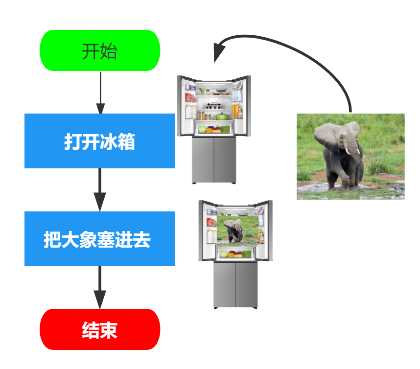
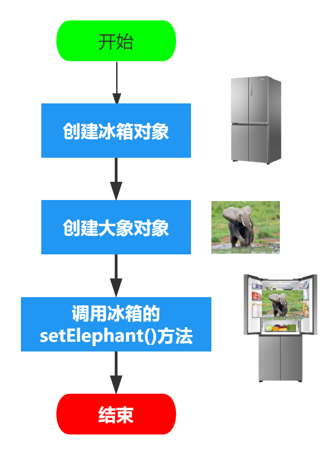
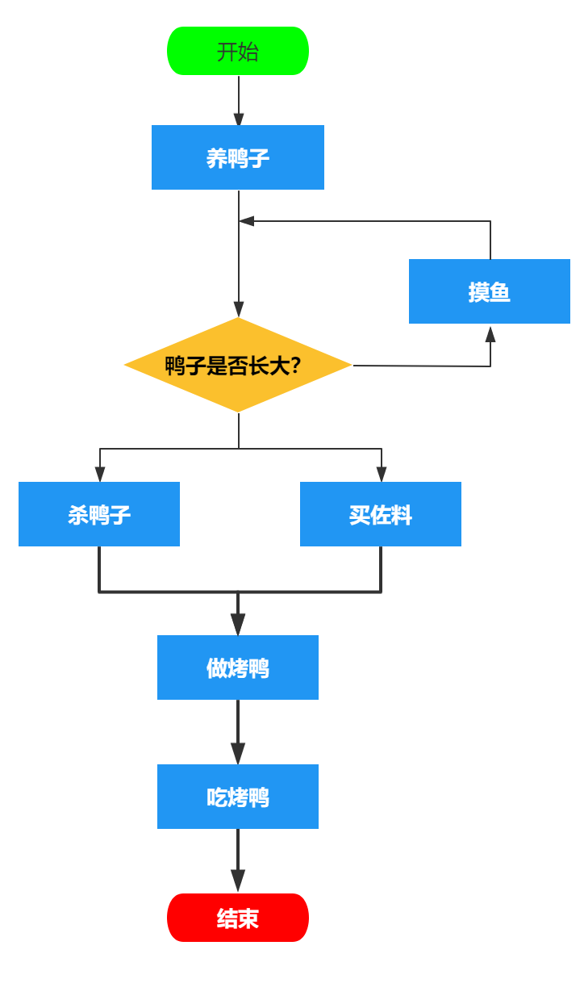
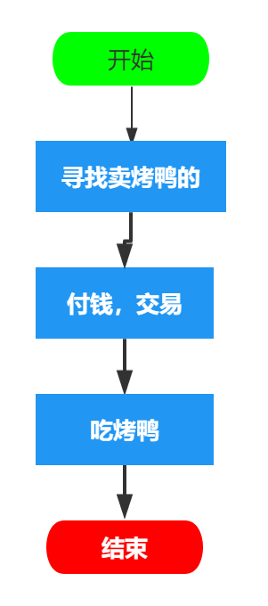

### 一、面向对象编程 与 面向过程编程

#### 面向过程编程（结构化的编程、Procedual）

传统的结构化的编程，为了解决一个问题，需要由一个个过程集合组成的，当选定了某个过程，下一步才会找到合适的方式来存储数据。

获得过图灵奖的Pascal之父尼古拉斯·沃斯，这样描述程序的："**算法 + 数据结构 = 程序**"

#### 面向对象编程（Object-oriented Programming 或 OOP）

- 万物皆对象
- 每个对象都有一个特定的功能，暴露给用户进行使用，但是具体实现细节被隐藏起来了
- 大多数对象都可以从类库中拿来使用，少数对象需要自己创建
- 只要对象提供的功能能满足你的需要，你不需要关注它的内部是怎样实现的

#### 两者比较

- **思考方式不一样**

  面向对象先关注如何存入数据，然后才关心用什么样的算法来操作和处理这些数据

  面向过程先关注采用什么样的过程来处理数据，然后才会考虑用什么样的结构来使操作更简单

  比如：**怎样将大象放进冰箱？**

  - 使用面向过程

    

  - 使用面向对象

    

  ###### S1：大象类

  ```java
  import lombok.Data;
  import lombok.extern.slf4j.Slf4j;
  
  /**
   * 大象
   * @author Aris Hu created at 2022-08-12
   */
  @Slf4j
  @Data
  public class Elephant {
  
    /** 大象标识 */
    private String eleId;
  
    public Elephant(String eleId) {
      this.eleId = eleId;
    }
  
    public void eat() {
      logger.info("eat grass.");
    }
  
    public void shout() {
      logger.info("em, em, ...");
    }
  }
  ```

  ###### S2：冰箱类

  ```java
  import lombok.Data;
  
  import java.time.LocalDateTime;
  import java.util.ArrayList;
  import java.util.List;
  
  /**
   * 冰箱类
   * @author Aris Hu created at 2022-08-12
   */
  @Data
  public class Refrigerator {
  
    private Long id;
  
    private LocalDateTime createdDate;
  
    private String createdBy;
  
    private LocalDateTime updatedDate;
  
    private String updatedBy;
  
    /** 冰箱唯一编号 */
    private String serialNo;
  
    /** 冰箱型号 */
    private String modelId;
  
    /** 冰箱额定电压 */
    private Short ratedVoltage;
  
    /** 功率 */
    private Short power;
  
    /** 冰箱长度 */
    private Short length;
  
    /** 冰箱宽度 */
    private Short width;
  
    /** 冰箱高度 */
    private Short height;
  
    /** 存放东西的容器 */
    private List<Object> things;
  
    public Refrigerator(String serialNo, String modelId) {
      this.serialNo = serialNo;
      this.modelId = modelId;
      this.things = new ArrayList<>(20);
    }
  
    /**
     * 放东西进冰箱
     * @param thing 物体
     */
    public void put(Object thing) {
      things.add(thing);
    }
  }
  ```

  ###### S3：将大象放进冰箱

  ```java
  import lombok.extern.slf4j.Slf4j;
  import org.junit.jupiter.api.DisplayName;
  import org.junit.jupiter.api.Test;
  
  /**
   * 面向对象测试类
   * @author Aris Hu created at 2022-08-12
   */
  @Slf4j
  @DisplayName("面向对象测试类")
  public class OOPTest {
  
    @Test
    @DisplayName("测试将大象放进冰箱")
    public void testElephantSaveIntoRefrigerator() {
      final Refrigerator refrigerator = new Refrigerator("38294732090438", "BCD-91C");
      logger.info("Refrigerator: {}", refrigerator);
      final Elephant     elephant     = new Elephant("007");
      logger.info("Elephant: {}", elephant);
      refrigerator.put(elephant);
    }
  }
  ```

  

- **面向对象比面向过程更容易处理复杂的问题**

  比如：要实现一个浏览器的功能

  使用面向过程，可能需要2000个过程来实现，每一个过程都需要处理全局的数据

  而使用面向对象，可能只需要100个对象，每个对象中20个方法。

  所以面向对象这种设计方式更容易理解，

  而且在出现 bug 的时候，面向对象比面向过程更容易找到问题所在

#### 例子：吃烤鸭

- 面向过程

  

- 面向对象

  


